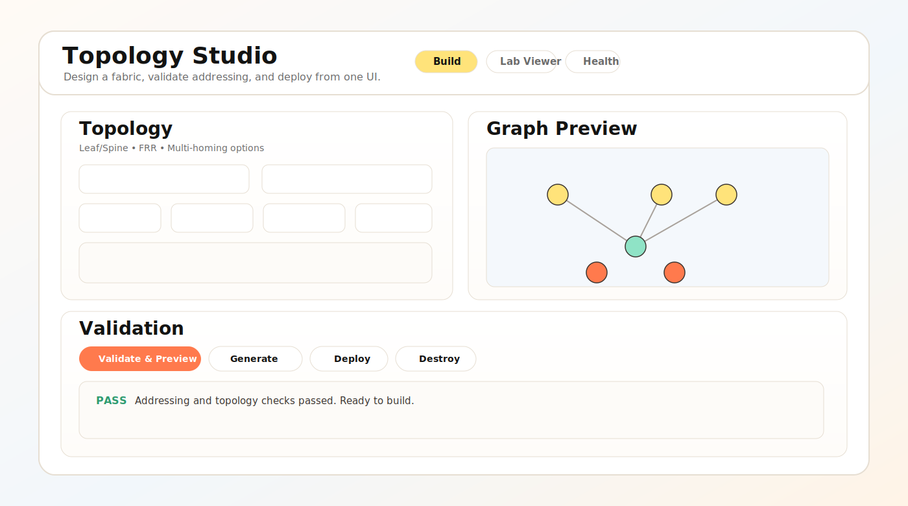

# Arista Lab Topology Studio

Build, validate, and deploy Containerlab topologies from a web UI.



## What This App Does
- Designs labs from the **Build** page (leaf/spine, hub/spoke, mesh, custom).
- Generates full lab artifacts under `.labs/<lab-name>/`.
- Deploys and destroys labs directly from the UI.
- Supports FRR and cEOS node types.
- Includes optional monitoring helpers (Prometheus/Grafana links and starter queries).

## Quick Start (One Command)
### Prerequisites (host machine)
- `multipass`
- `make`
- `git`

From the repo root, run:
```bash
make vm_up
```

That target handles VM/bootstrap/server setup and prints the web URL at the end, for example:
```text
UI available at: http://<vm-ip>:8080
```

Open that URL in your browser.

## First Run Workflow
1. Go to **Build**.
2. Choose topology and node type.
3. Click **Validate & Preview**.
4. Click **Generate Lab**.
5. Click **Deploy Lab**.
6. Use **Lab Viewer** and **Health** tabs to inspect and verify.

## Useful Commands
```bash
# open a shell in the VM
make vm_shell

# rebuild and restart the UI server after code changes
make vm_rebuild

# print the UI URL again
make vm_ui

# print Grafana/Prometheus URLs
make vm_monitoring
```

## Where Generated Labs Live
- Base directory: `.labs/`
- Example lab file: `.labs/frr-lab/lab.clab.yml`

## Monitoring Notes
- Grafana default credentials: `admin / admin`
- Prometheus and Grafana links are exposed from the Build page and `make vm_monitoring`.

Starter PromQL examples:
```promql
up
up{job="snmp"}
up{job="gnmi"}
rate(ifHCInOctets[5m])
rate(ifHCOutOctets[5m])
```

## Troubleshooting
- If the VM exists but is stopped:
  ```bash
  multipass start lab-builder
  ```
- If setup drifted, rebuild service artifacts:
  ```bash
  make vm_rebuild
  ```
- If you want a fresh VM:
  ```bash
  multipass stop lab-builder
  multipass delete --purge lab-builder
  make vm_up
  ```
