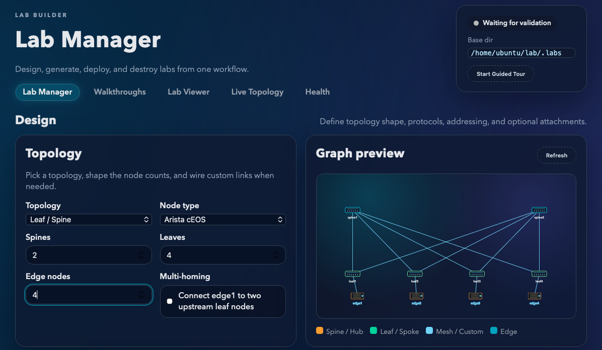

# Lab Builder

Build, validate, and deploy Containerlab topologies from a web UI.



## What This App Does
- Designs labs from the **Build** page (leaf/spine, hub/spoke, mesh, custom).
- Designs labs from the **Lab Manager** page (leaf/spine, hub/spoke, mesh, custom).
- Includes guided **Lab Walkthroughs** with predefined topologies and learning goals.
- Generates full lab artifacts under `.labs/<lab-name>/`.
- Deploys and destroys labs directly from the UI.
- Supports FRR and cEOS node types.
- Includes optional monitoring helpers (Prometheus/Grafana links and starter queries).

## Quick Start (One Command)
### Prerequisites (host machine)
- `multipass`
- `make`
- `git`
- Internet access for first-run package/image downloads

### Install Prerequisites
#### macOS (Homebrew)
```bash
# install Homebrew first if needed: https://brew.sh
brew install --cask multipass
brew install make git
```

#### Ubuntu / Debian
```bash
sudo apt-get update
sudo apt-get install -y make git
sudo snap install multipass
```

#### Verify installs
```bash
multipass version
make --version
git --version
```

### Install Troubleshooting
#### macOS: `multipass` command works but VM actions fail
Symptoms:
- `multipass list` hangs or shows daemon/socket errors

Fix:
```bash
open -a Multipass
sudo launchctl kickstart -k system/com.canonical.multipassd
multipass list
```

#### Ubuntu/Debian: `snap` not available
Symptoms:
- `snap: command not found`

Fix:
```bash
sudo apt-get update
sudo apt-get install -y snapd
sudo systemctl enable --now snapd
sudo snap install multipass
```

#### Ubuntu/Debian: `snap` installed but Multipass won’t start
Symptoms:
- `multipass list` fails with daemon errors

Fix:
```bash
sudo systemctl restart snapd
sudo snap restart multipass
multipass list
```

#### `make` not found
Symptoms:
- `make: command not found`

Fix:
```bash
# macOS
brew install make

# Ubuntu/Debian
sudo apt-get install -y make
```

#### Permission denied talking to Multipass
Symptoms:
- socket/permission denied errors

Fix:
```bash
# macOS
sudo multipass list

# Linux (add user to multipass group, then re-login)
sudo usermod -aG multipass "$USER"
newgrp multipass
multipass list
```

From the repo root, run:
```bash
make vm_up
```

That target handles VM/bootstrap/server setup and prints the web URL at the end, for example:
```text
UI available at: http://<vm-ip>:8080
```

Open that URL in your browser.

## First Run Workflow
1. Go to **Lab Manager**.
2. Choose topology and node type.
3. Click **Validate & Preview**.
4. Click **Generate Lab**.
5. Click **Deploy Lab**.
6. Use **Lab Viewer** and **Health** tabs to inspect and verify.

## Lab Walkthroughs (Guided Labs)
Use the **Walkthroughs** page to launch opinionated labs designed for learning by doing.

Each walkthrough shows:
- Lab name
- What you will learn
- Estimated duration
- Readiness status

When you launch a walkthrough:
1. The app checks if another lab is already deployed.
2. If one exists, it prompts to tear down the existing lab first.
3. On confirmation, it destroys the old lab and deploys the selected walkthrough lab.

### First guided lab included
- **EVPN/VXLAN Stretched L2 (Foundation)**
- Topology: **1 spine, 2 leaf, 2 edge**
- Node type: **FRR**
- Base state: infra IPs + vanilla BGP IPv4 unicast underlay
- Goal: walk through remaining overlay config and validation until edge-to-edge ping succeeds

## Useful Commands
```bash
# open a shell in the VM
make vm_shell

# rebuild and restart the UI server after code changes
make vm_rebuild

# print the UI URL again
make vm_ui

# print Grafana/Prometheus URLs
make vm_monitoring
```

## Where Generated Labs Live
- Base directory: `.labs/`
- Example lab file: `.labs/frr-lab/lab.clab.yml`

## Monitoring Notes
- Grafana default credentials: `admin / admin`
- Prometheus and Grafana links are exposed from the Build page and `make vm_monitoring`.

Starter PromQL examples:
```promql
up
up{job="snmp"}
up{job="gnmi"}
rate(ifHCInOctets[5m])
rate(ifHCOutOctets[5m])
```

## Contributing
Contributions are welcome. The goal is to keep changes small, testable, and easy to review.

### Development Workflow
1. Create a feature branch from `main`.
2. Make focused changes (one feature/fix per PR).
3. Rebuild and verify in the VM:
   ```bash
   make vm_rebuild
   make vm_server_status_service
   ```
4. Validate the behavior in the UI (`make vm_ui` to print the URL).
5. Open a PR with a clear summary and verification notes.

### Repo Structure (High Level)
- `src/internal/app`: HTTP handlers, server wiring, runtime/deploy logic.
- `src/web/templates`: HTML templates.
- `src/web/static`: frontend JS/CSS.
- `src/labplanner`: topology planning/address assignment.
- `src/configgenerator`: containerlab + node config rendering.
- `src/labstore`: lab metadata persistence.

### Coding Guidelines
- Prefer small, explicit changes over broad refactors.
- Keep backend behavior covered by tests in `src/internal/app/*_test.go` when possible.
- Preserve existing API/JSON response shapes unless intentionally changing contract.
- Avoid committing generated/runtime artifacts (for example `.labs/`, `.clab-runs/`, captures, binaries).

### Testing Expectations
- At minimum, run:
  ```bash
  cd src
  go test ./internal/app
  ```
- If your change touches planner/generator logic, also run:
  ```bash
  cd src
  go test ./labplanner ./configgenerator
  ```
- If a full `go test ./...` fails due to known unrelated issues, mention that in the PR.

### PR Checklist
- Problem and scope are clearly described.
- User-visible behavior changes are documented.
- Tests were run and results are included.
- Screenshots/GIFs included for UI changes.
- Backward compatibility impacts (if any) are called out.

## Troubleshooting
- If the VM exists but is stopped:
  ```bash
  multipass start lab-builder
  ```
- If setup drifted, rebuild service artifacts:
  ```bash
  make vm_rebuild
  ```
- If SRv6 walkthrough packets hit endpoint `eth*` but no ICMP reply is seen:
  - Keep SID endpoints (for example `2001:db8:100:3::100`) as `local ... encap seg6local` routes, not loopback interface addresses.
  - Ensure `seg6_enabled` is on globally and on ingress interfaces (for example `eth1/eth2`).
  - Quick checks:
    ```bash
    ip -6 route show table local | grep seg6local
    sysctl net.ipv6.conf.all.seg6_enabled
    sysctl net.ipv6.conf.eth1.seg6_enabled
    sysctl net.ipv6.conf.eth2.seg6_enabled
    ```
- If you only have FRR images, that's fine. cEOS image import is optional in `setup-multipass.sh`.
- If you want a fresh VM:
  ```bash
  multipass stop lab-builder
  multipass delete --purge lab-builder
  make vm_up
  ```
